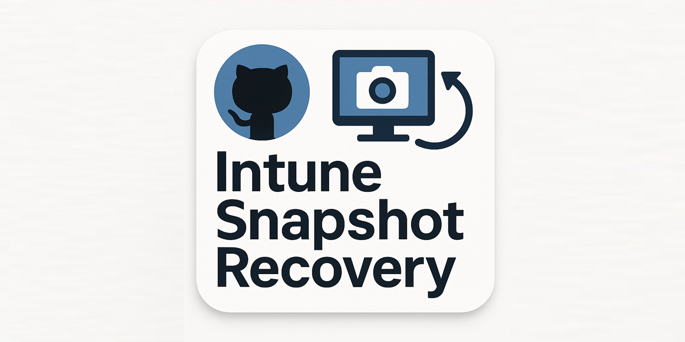

# Intune Snapshot Recovery

A toolkit for backing up, restoring, and managing Microsoft Intune tenant configurations using Github Actions and PowerShell scripts.

<p align="center">
  
</p>

## 🚀 Overview

This repository provides automated solutions for:

- **Tenant Snapshots**: Create point-in-time backups of your entire Intune tenant
- **Configuration Recovery**: Restore specific policies or entire tenant configurations
- **Environment Migration**: Copy configurations between tenants (DEV → PROD)
- **Disaster Recovery**: Quickly restore tenant state from snapshots
- **Policy Management**: Bulk import/export of Intune policies and configurations
- **Scheduled Automation**: Daily automated backups via GitHub Actions
- **JSON Encoding**: Built-in UTF-8 conversion for compatibility
- **Dry Run Testing**: Preview import operations without making changes
- **Comprehensive Logging**: Detailed execution logs with automatic rotation

**🔧 Powered by IntuneManagement**

This toolkit leverages the powerful [IntuneManagement](https://github.com/Micke-K/IntuneManagement) project as its core engine. The IntuneManagement tool provides the robust Microsoft Graph API integration and comprehensive Intune object type support that makes this automation possible.

## 📁 Repository Structure

```
├── .github/workflows/              # GitHub Actions workflows
│   ├── IntuneExportParameterized.yml    # Parameterized export workflow (with scheduling)
│   └── IntuneImportParameterized.yml    # Parameterized import workflow (with dry run)
├── intune-backup/                  # Backup storage directory
│   └── [tenant-name]/             # Tenant-specific backups
│       ├── Applications/
│       ├── CompliancePolicies/
│       ├── DeviceConfiguration/
│       └── [other-policy-types]/
├── Invoke-IntuneBackupRestore.ps1  # Unified backup/restore script with dynamic configuration
├── logs/                           # Execution logs directory (auto-created)
│   └── IntuneBackupRestore_*.log   # Timestamped log files
└── README.md
```

## 🛠️ Prerequisites

### Azure AD App Registration

You'll need an Azure AD app registration with the following permissions:

**Microsoft Graph API Permissions:**

- `DeviceManagementApps.ReadWrite.All`
- `DeviceManagementConfiguration.ReadWrite.All`
- `DeviceManagementManagedDevices.ReadWrite.All`
- `DeviceManagementServiceConfig.ReadWrite.All`
- `Group.Read.All`
- `GroupMember.Read.All`
- `User.Read.All`
- `Agreement.Read.All` (Optional for exporting Terms of use objects)
- `Agreement.ReadWrite.All` (Optional for exporting Terms of use objects)

**Directory (Azure AD) Graph Permissions:**

- `Policy.ReadWrite.ConditionalAccess`
- `Policy.Read.All`

### Required Secrets (for GitHub Actions)

Configure these secrets in your GitHub repository:

- `AZURE_TENANT_ID`: Your Azure AD tenant ID
- `AZURE_CLIENT_ID`: Azure AD app registration client ID
- `AZURE_CLIENT_SECRET`: Azure AD app registration client secret

### Local Requirements

- PowerShell 5.1 (PowerShell Core v6+ not currently supported)
- Git (for cloning IntuneManagement tool)
- Internet connection (to download dependencies)

## 🚀 Quick Start

### 1. Clone Repository

```bash
git clone https://github.com/jorgeasaurus/Intune-Snapshot-Recovery
cd intune-snapshot-recovery
```

### 2. Local Backup (PowerShell)

```powershell
# Basic backup
.\Invoke-IntuneBackupRestore.ps1 `
    -Action Backup `
    -TenantId "your-tenant-id" `
    -AppId "your-app-id" `
    -Secret "your-secret" `
    -BackupPath ".\intune-backup\production"

# Customized backup with specific options
.\Invoke-IntuneBackupRestore.ps1 `
    -Action Backup `
    -TenantId "your-tenant-id" `
    -AppId "your-app-id" `
    -Secret "your-secret" `
    -BackupPath ".\intune-backup\custom" `
    -AddCompanyName $true `
    -ExportAssignments $true
```

### 3. Local Restore (PowerShell)

```powershell
# Basic restore from backup
.\Invoke-IntuneBackupRestore.ps1 `
    -Action Restore `
    -TenantId "your-tenant-id" `
    -AppId "your-app-id" `
    -Secret "your-secret" `
    -BackupPath ".\intune-backup\production"

# Dry run restore (preview only)
.\Invoke-IntuneBackupRestore.ps1 `
    -Action Restore `
    -TenantId "your-tenant-id" `
    -AppId "your-app-id" `
    -Secret "your-secret" `
    -BackupPath ".\intune-backup\production" `
    -DryRun
```

### 4. GitHub Actions Workflows

#### Automated Daily Backup

The `IntuneExportParameterized.yml` workflow runs daily at 14:00 UTC and can be triggered manually.

#### Parameterized Export

Use `IntuneExportParameterized.yml` for custom export operations:

1. Go to **Actions** → **Intune Export - Parameterized**
2. Click **Run workflow**
3. Configure parameters:
   - Export path
   - Object types to include
   - Export options (assignments, scripts, etc.)
   - Company name inclusion
   - Application file export
   - **Scheduled execution**: Automatically runs daily at 14:00 UTC

#### Parameterized Import

Use `IntuneImportParameterized.yml` for custom import operations:

1. Go to **Actions** → **Intune Import - Parameterized**
2. Click **Run workflow**
3. Configure parameters:
   - Import path
   - Import behavior (skip/overwrite/append)
   - Conditional Access state
   - **Dry run option** for safe testing
   - Assignment import control
   - Dependency ID replacement

## 📝 Configuration & Logging

### Dynamic Configuration Generation

The `Invoke-IntuneBackupRestore.ps1` script automatically generates configuration files based on parameters, eliminating the need for manual JSON file management. All configuration is done through script parameters for maximum flexibility and ease of use.

### Execution Logging

The script automatically generates detailed execution logs for troubleshooting and audit purposes:

**Features:**

- **Automatic Log Creation**: Logs are saved to `.\logs\` directory (auto-created)
- **Timestamped Files**: Format: `IntuneBackupRestore_[Action]_[Timestamp].log`
- **Detailed Information**: Includes script parameters, execution steps, and outcomes
- **Automatic Cleanup**: Old log files (30+ days) are automatically removed
- **Security**: Sensitive information (secrets) are redacted from logs

**Log Control:**

```powershell
# Enable logging (default)
.\Invoke-IntuneBackupRestore.ps1 `
    -Action Backup `
    -TenantId "..." `
    -AppId "..." `
    -Secret "..." `
    -BackupPath "..." `
    -EnableLogging $true

# Disable logging
.\Invoke-IntuneBackupRestore.ps1 `
    -Action Backup `
    -TenantId "..." `
    -AppId "..." `
    -Secret "..." `
    -BackupPath "..." `
    -EnableLogging $false

# Custom log directory
.\Invoke-IntuneBackupRestore.ps1 `
    -Action Backup `
    -TenantId "..." `
    -AppId "..." `
    -Secret "..." `
    -BackupPath "..." `
    -LogPath "C:\MyLogs"
```

### Parameter-Based Configuration

The unified script allows you to specify all configuration options directly as parameters, providing maximum flexibility without requiring configuration files:

```powershell
# Advanced backup with selective object types
.\Invoke-IntuneBackupRestore.ps1 `
    -Action Backup `
    -TenantId "$env:AZURE_TENANT_ID" `
    -AppId "$env:AZURE_CLIENT_ID" `
    -Secret "$env:AZURE_CLIENT_SECRET" `
    -BackupPath ".\selective-backup" `
    -ObjectTypes @("CompliancePolicies", "DeviceConfiguration") `
    -ExportAssignments $true

# Restore with specific import behavior
.\Invoke-IntuneBackupRestore.ps1 `
    -Action Restore `
    -TenantId "$env:AZURE_TENANT_ID" `
    -AppId "$env:AZURE_CLIENT_ID" `
    -Secret "$env:AZURE_CLIENT_SECRET" `
    -BackupPath ".\intune-backup\production" `
    -ImportType "overwrite" `
    -ImportAssignments $true `
    -CAState "disabled"
```

## 🎯 Use Cases

### Daily Tenant Snapshots

- Automated daily backups via GitHub Actions
- Version-controlled configuration history
- Quick rollback capabilities

### Environment Promotion

```powershell
# Export from DEV tenant
.\Invoke-IntuneBackupRestore.ps1 `
    -Action Backup `
    -TenantId "dev-tenant-id" `
    -AppId "app-id" `
    -Secret "secret" `
    -BackupPath ".\dev-export"

# Import to PROD tenant
.\Invoke-IntuneBackupRestore.ps1 `
    -Action Restore `
    -TenantId "prod-tenant-id" `
    -AppId "app-id" `
    -Secret "secret" `
    -BackupPath ".\dev-export"
```

### Disaster Recovery

1. Restore from latest backup in `intune-backup/` directory
2. Use dry run to validate before applying changes
3. Selective restore of specific policy types

### Configuration Testing

1. Use **dry run mode** in GitHub Actions
2. Validate configurations without applying changes
3. Test import behavior safely

## 🔧 Advanced Usage

### Selective Object Type Export

```powershell
# Only export specific object types using parameters
.\Invoke-IntuneBackupRestore.ps1 `
    -Action Backup `
    -TenantId "$env:AZURE_TENANT_ID" `
    -AppId "$env:AZURE_CLIENT_ID" `
    -Secret "$env:AZURE_CLIENT_SECRET" `
    -BackupPath ".\selective-backup" `
    -ObjectTypes @("CompliancePolicies", "DeviceConfiguration", "AppProtection")
```

### Custom Import Behavior

- `skipIfExist`: Skip if policy already exists
- `overwrite`: Replace existing policies
- `append`: Add new policies only

### Conditional Access Handling

- `disabled`: Import CA policies in disabled state
- `enabled`: Import CA policies as enabled
- `enabledForReportingButNotEnforced`: Report-only mode

## 🚨 Important Notes

### Security Considerations

- Store Azure credentials securely in GitHub Secrets
- Use service principal with minimal required permissions
- Regularly rotate client secrets
- Review export contents before committing to version control

### Best Practices

- Always test imports in non-production environments first
- Use dry run mode to validate configurations
- Maintain separate configurations for different tenants
- Regular backup schedule (daily recommended)
- Document any custom configurations or filters

### Limitations

- Some settings may not be exportable/importable
- Tenant-specific GUIDs will be different between environments
- Some dependencies may need manual configuration
- Rate limiting may affect large tenant operations

## 🐛 Troubleshooting

### Common Issues

**PowerShell Execution Policy**

```powershell
Set-ExecutionPolicy -ExecutionPolicy RemoteSigned -Scope CurrentUser
```

**Authentication Failures**

- Verify Azure AD app permissions
- Check client secret expiration
- Confirm tenant ID is correct

### Debug Mode

Add `-Verbose` parameter to scripts for detailed logging:

```powershell
.\Invoke-IntuneBackupRestore.ps1 `
    -Action Backup `
    -TenantId "tenant" `
    -AppId "app" `
    -Secret "secret" `
    -BackupPath ".\debug-backup" `
    -Verbose
```

### Log Analysis

Review execution logs for detailed troubleshooting information:

```powershell
# View latest log file
Get-ChildItem -Path ".\logs" -Filter "IntuneBackupRestore_*.log" |
Sort-Object LastWriteTime -Descending | Select-Object -First 1 | Get-Content

# Search for errors in recent logs
Get-ChildItem -Path ".\logs" -Filter "IntuneBackupRestore_*.log" |
Sort-Object LastWriteTime -Descending | Select-Object -First 5 |
ForEach-Object { Select-String -Path $_.FullName -Pattern "ERROR" }
```

## 📚 Additional Resources

- [IntuneManagement Tool](https://github.com/Micke-K/IntuneManagement) - Underlying backup/restore engine
- [Microsoft Graph API Documentation](https://docs.microsoft.com/en-us/graph/api/resources/intune-graph-overview)
- [Azure AD App Registration Guide](https://docs.microsoft.com/en-us/azure/active-directory/develop/quickstart-register-app)

## 🤝 Contributing

1. Fork the repository
2. Create a feature branch
3. Make your changes
4. Test thoroughly
5. Submit a pull request

## 📄 License

This project is licensed under the MIT License - see the LICENSE file for details.

## ⚠️ Disclaimer

This tool is provided as-is. Always test in non-production environments first. The authors are not responsible for any data loss or configuration issues that may arise from using this tool.
